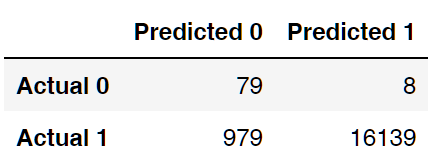

# Credit Risk Analysis

## 1 Overview of the analysis

In this report we have employed different techniques to train and evaluate models with unbalanced classes.  We have used imbalanced-learn and scikit-learn libraries to build and evaluate models using resampling.

We used a credit card credit dataset from LendingClub, a peer-to-peer lending services company, and oversampled the data using the RandomOverSampler and SMOTE algorithms, and undersampled the data using the ClusterCentroids algorithm. Then, we used a combinatorial approach of over- and undersampling using the SMOTEENN algorithm.  Next, we compared two new machine learning models that reduce bias, BalancedRandomForestClassifier and EasyEnsembleClassifier, and predicted credit risk. We have evaluated the performance of these models and made a written recommendation on whether LendingClub should use them to predict credit risk.

## 2 Results

In this section we evaluated three machine learning models by using resampling to determine which is better at predicting credit risk.

Due to the nature of this particular analysis the results section is broken down as follows:

2.1 Resampling Models used to Predict Credit Risk

2.2 SMOTEENN Algorithm used to Predict Credit Risk

2.3 Ensemble Classifiers used Predict Credit Risk

2.4 Comparison of machine learning models

### 2.1 Resampling Models used to Predict Credit Risk 

In this section we evaluated three machine learning models by using resampling to determine which is better at predicting credit risk. First, we used the oversampling RandomOverSampler and SMOTE algorithms, and then we used the undersampling ClusterCentroids algorithm. Using these algorithms, we resampled the dataset, viewed the count of the target classes, trained a logistic regression classifier, calculated the balanced accuracy score, generated a confusion matrix, and a classification report.

Using the information provided in the starter code, we created our training and target variables by completing the following steps:

- Created the training variables by converting the string values into numerical ones using the get_dummies() method.
- Created the target variables.
- Checked the balance of the target variables.

Next, we resampled the training data. First, using the oversampling RandomOverSampler, then using the SMOTE algorithm and finally undersampling using the ClusterCentroids algorithm to resample the data. For each resampling algorithms, we did the following:

- Used the LogisticRegression classifier to make predictions and evaluate the model’s performance.
- Calculate the accuracy score of the model.
- Generate a confusion matrix.
- Print out the imbalanced classification report.

The fully executed results can be found in the  credit_risk_resampling.ipynb notebook file in our Credit_Risk_Analysis folder.  For all three algorithms, the following have been completed:

- An accuracy score for the model ws calculated
- A confusion matrix has been generated
- An imbalanced classification report has been generated

### 2.2 SMOTEENN algorithm used to Predict Credit Risk

In these section we used a combinatorial approach of over- and undersampling with the SMOTEENN algorithm to determine if the results from the combinatorial approach are better at predicting credit risk than the resampling algorithms discussed in section 2.1. Using the SMOTEENN algorithm, we resampled the dataset, viewed the count of the target classes, trained a logistic regression classifier, calculated the balanced accuracy score, generated a confusion matrix, and a classification report.  For this part of the analysis we continued using your credit_risk_resampling.ipynb notebook file where we had already created our training and target variables. The following additional steps were then added:

- We resampled the training data using the SMOTEENN algorithm.
- Used the LogisticRegression classifier to make predictions and evaluate the model’s performance.
- Calculated the accuracy score of the model, generated a confusion matrix, and then printed out the imbalanced classification report.

The fully executed results can be from in our credit_risk_resampling.ipynb notebook file in our Credit_Risk_Analysis folder.

Using the combinatorial SMOTEENN algorithm we did the following:
- An accuracy score for the model was calculated 
- A confusion matrix has been generated 
- An imbalanced classification report has been generated 

### 2.3 Ensemble Classifiers used to Predict Credit Risk

In this section we trained and compared two different ensemble classifiers, BalancedRandomForestClassifier and EasyEnsembleClassifier, to predict credit risk and we evaluated each model. Using both algorithms, we resampled the dataset, viewed the count of the target classes, trained the ensemble classifier, calculated the balanced accuracy score, generated a confusion matrix, and generated a classification report.

We created our training and target variables by completing the following:

- Created the training variables by converting the string values into numerical ones using the get_dummies() method.
- Created the target variables.
- Checked the balance of the target variables.

We resampled the training data using the BalancedRandomForestClassifier algorithm with <u>100 estimators</u>.

After the data was resampled, we calculated the accuracy score of the model, generated a confusion matrix, and then printed out the imbalanced classification report.

We also printed the feature importance sorted in descending order, along with the feature score.

Next, we resampled the training data using the EasyEnsembleClassifier algorithm with <u>100 estimators</u>.

After the data was resampled, we calculated the accuracy score of the model, generated a confusion matrix, and then printed out the imbalanced classification report.

Finally we saved our credit_risk_ensemble.ipynb file to our Credit_Risk_Analysis folder.  The fully executed note demonstrates the following:

- The BalancedRandomForestClassifier algorithm does the following:
  - An accuracy score for the model is calculated
  - A confusion matrix has been generated
  - An imbalanced classification report has been generated 
  - The features are sorted in descending order by feature importance
- The EasyEnsembleClassifier algorithm does the following:
  - An accuracy score of the model is calculated
  - A confusion matrix has been generated
  - An imbalanced classification report has been generated

### 2.4 Comparison of machine learning models 

The Jupyter Notebooks contain the various output that have been used to bring together the results that are summarized below for convenience.

Table 1 is taken from the "BAS" tab of the results_tables.xlsx file that is available in the Credit_Risk_Analysis folder.  The table has been sorted by the column "Balanced Accuracy Score" from lowest to highest.

***Table 1 - Comparison of Balanced Accuracy Scores***

Table 2 has been inserted to remind the reader about the details behind predictions and actual results and how they should be interpreted.

***Table 2 - Detailed Description of Outcomes Matrix***

Table 3 is a screenshot of the confusion matrix of the Easy Ensemble Classifier, an adaptive boosting algorithm.

***Table 3 - Confusion Matrix AdaBoost***

Table 4 is a screenshot of the imbalanced classification report from the same Easy Ensemble Classifier algorithm.

***Table 4 - Imbalanced Classification Report AdaBoost***

The equations below have been implemented in the results_table.xlsx to calculate much of what can be found in the classification report.  For each of the six algorithms we created a tab in the results_tables.xlsx.  On these tabs we copied and pasted the confusion matrix and the classification reports from the Jupyter notebook.  Using only the confusion matrix numbers we then calculated every metric found in Table 5 and compared it to numbers found in the Jupyter Notebook results.  For example, you will notice the numbers for BAS copied into Table 1 are exactly the same as those in Table 5. 

***Table 5 - Summary of Performance Metrics***

## 3 Summary 

In the sections below is a discussion of a number of important metrics that have  been calculated and verified.  While it may seem obvious that the Easy Ensemble classifier is being recommend for use by LendingClub we would recommend that you review the details as they truly support the case that this algorithm is significantly better for your purpose.

### 3.1 Precision

All of the models have a high score for precision, but this is to be expected because the data set is so unbalanced.  If we had an algorithm that had only one outcome "Low-Risk"  it would still have a precision of 99.494%, so the precision metric should not be used in the assessment.

### 3.2 Recall

The true positive rate (TPR, also called sensitivity or recall) is the probability that an actual positive will test positive.  You can see from the results that the Cluster Centroids is particularly bad at accurately predicting low-risk credit scores.  You will also notice that both the Balanced Random Forest and Easy Ensemble classifiers preformed well. Recall is important in identifying low-risk credit accurately to reduce the number of files you need to investigate.  

### 3.3 Specificity

The true negative rate (TNR also called specificity), is the probability that an actual negative will test negative.  The only classifier that performed well in this category was the Easy Ensemble classifier.  This measure is particularly important since the objective of the machine learning algorithm is to identify high-risk loans.  Notice how poorly the Balanced Random Forest classifier performed in this metric in comparison to the Easy Ensemble classifier.

### 3.4 False Negative Rate

The false negative rate is the proportion of positives which yield negative test outcomes.  This is a useful measurement in that it validates that the TPR has been correctly calculated since the sum of the two should equal 1.0.  Again the Easy Ensemble classifier is the best.

### 3.5 F1 Score

The highest possible value of an F-score is 1.0, indicating perfect precision and recall, and the lowest possible value is 0, if either the precision or the recall is zero.   In this case the F1 score is not really much more valuable than the recall since the precision value is nearly 1.0 for all algorithms.  You will, however, notice that the F1 score did indicate that for this metric SMOTE was better than SMOTEENN.

### 3.6 Balanced Accuracy

The Balanced Accuracy (BA) score relies on two important metrics, the True Negative Rate (TNR) and the True Positive Rate (TNR).  Since the Easy Ensemble classifier performed best in both these categories its BA is much higher than all other algorithms for this imbalanced data set. 
