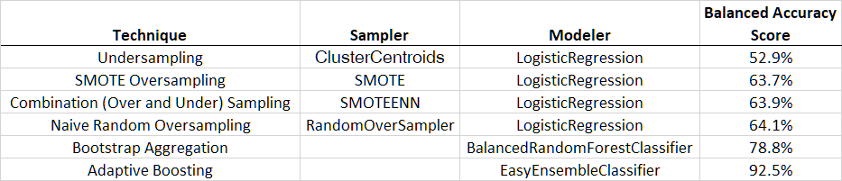
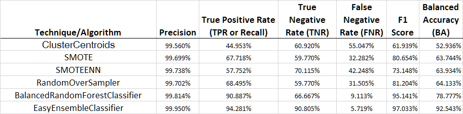

# Credit Risk Analysis

## 1 Overview of the analysis

Explain the purpose of this analysis.

- Overview of the loan prediction risk analysis:
  - The purpose of this analysis is well defined **(4 pt)**
- The written analysis has the following structure, organization, and formatting:
  - There is a title, and there are multiple sections **(2 pt)**
  - Each section has a heading and subheading **(2 pt)**
  - Links to images are working, and code is formatted and displayed correctly **(2 pt)**.

Therefore, you’ll need to employ different techniques to train and evaluate models with unbalanced classes. Jill asks you to use imbalanced-learn and scikit-learn libraries to build and evaluate models using resampling.

Using the credit card credit dataset from LendingClub, a peer-to-peer lending services company, you’ll oversample the data using the RandomOverSampler and SMOTE algorithms, and undersample the data using the ClusterCentroids algorithm. Then, you’ll use a combinatorial approach of over- and undersampling using the SMOTEENN algorithm. Next, you’ll compare two new machine learning models that reduce bias, BalancedRandomForestClassifier and EasyEnsembleClassifier, to predict credit risk. Once you’re done, you’ll evaluate the performance of these models and make a written recommendation on whether they should be used to predict credit risk.

## 2 Results

Using bulleted lists, describe the balanced accuracy scores and the precision and recall scores of all six machine learning models. Use screenshots of your outputs to support your results.

Results:

- There is a bulleted list that describes the balanced accuracy score and the precision and recall scores of all six machine learning models **(15 pt)**

This new assignment consists of three technical analysis deliverables and a written report. You will submit the following:

- Deliverable 1: Use Resampling Models to Predict Credit Risk
- Deliverable 2: Use the SMOTEENN Algorithm to Predict Credit Risk
- Deliverable 3: Use Ensemble Classifiers to Predict Credit Risk

### 2.1 Use Resampling Models to Predict Credit Risk 

Using your knowledge of the `imbalanced-learn` and `scikit-learn` libraries, you’ll evaluate three machine learning models by using resampling to determine which is better at predicting credit risk. First, you’ll use the oversampling `RandomOverSampler` and `SMOTE` algorithms, and then you’ll use the undersampling `ClusterCentroids` algorithm. Using these algorithms, you’ll resample the dataset, view the count of the target classes, train a logistic regression classifier, calculate the balanced accuracy score, generate a confusion matrix, and generate a classification report.

Using the information we’ve provided in the starter code, create your training and target variables by completing the following steps:

- Create the training variables by converting the string values into numerical ones using the `get_dummies()` method.
- Create the target variables.
- Check the balance of the target variables.

Next, begin resampling the training data. First, use the oversampling `RandomOverSampler` and `SMOTE` algorithms to resample the data, then use the undersampling `ClusterCentroids` algorithm to resample the data. For each resampling algorithm, do the following:

- Use the `LogisticRegression` classifier to make predictions and evaluate the model’s performance.
- Calculate the accuracy score of the model.
- Generate a confusion matrix.
- Print out the imbalanced classification report.


Save your `credit_risk_resampling.ipynb` file to your Credit_Risk_Analysis folder.

- For all three algorithms, the following have been completed:
  - An accuracy score for the model is calculated **(7.5 pt)**
  - A confusion matrix has been generated **(7.5 pt)**
  - An imbalanced classification report has been generated **(15 pt)**

### 2.2 Use the SMOTEENN algorithm to Predict Credit Risk

Using your knowledge of the `imbalanced-learn` and `scikit-learn` libraries, you’ll use a combinatorial approach of over- and undersampling with the `SMOTEENN` algorithm to determine if the results from the combinatorial approach are better at predicting credit risk than the resampling algorithms from Deliverable 1. Using the `SMOTEENN` algorithm, you’ll resample the dataset, view the count of the target classes, train a logistic regression classifier, calculate the balanced accuracy score, generate a confusion matrix, and generate a classification report.

1. Continue using your `credit_risk_resampling.ipynb` file where you have already created your training and target variables.
2. Using the information we have provided in the starter code, resample the training data using the `SMOTEENN` algorithm.
3. After the data is resampled, use the `LogisticRegression` classifier to make predictions and evaluate the model’s performance.
4. Calculate the accuracy score of the model, generate a confusion matrix, and then print out the imbalanced classification report.

Save your `credit_risk_resampling.ipynb` file to your Credit_Risk_Analysis folder.

- The combinatorial SMOTEENN algorithm does the following:
  - An accuracy score for the model is calculated **(5 pt)**
  - A confusion matrix has been generated **(5 pt)**
  - An imbalanced classification report has been generated **(5 pt)**

### 2.3 Use Ensemble Classifiers to Predict Credit Risk

Using your knowledge of the `imblearn.ensemble` library, you’ll train and compare two different ensemble classifiers, `BalancedRandomForestClassifier` and `EasyEnsembleClassifier`, to predict credit risk and evaluate each model. Using both algorithms, you’ll resample the dataset, view the count of the target classes, train the ensemble classifier, calculate the balanced accuracy score, generate a confusion matrix, and generate a classification report.

1. Using the information we have provided in the starter code, create your training and target variables by completing the following:

   - Create the training variables by converting the string values into numerical ones using the `get_dummies()` method.
   - Create the target variables.
   - Check the balance of the target variables.

2. Resample the training data using the

    

   ```
   BalancedRandomForestClassifier
   ```

    

   algorithm with 100 estimators.

   - Consult the following [Random Forest documentation (Links to an external site.)](https://imbalanced-learn.org/stable/references/generated/imblearn.ensemble.BalancedRandomForestClassifier.html) for an example.

3. After the data is resampled, calculate the accuracy score of the model, generate a confusion matrix, and then print out the imbalanced classification report.

4. Print the feature importance sorted in descending order (from most to least important feature), along with the feature score.

5. Next, resample the training data using the

    

   ```
   EasyEnsembleClassifier
   ```

    

   algorithm with 100 estimators.

   - Consult the following [Easy Ensemble documentation (Links to an external site.)](https://imbalanced-learn.org/stable/references/generated/imblearn.ensemble.EasyEnsembleClassifier.html) for an example.

6. After the data is resampled, calculate the accuracy score of the model, generate a confusion matrix, and then print out the imbalanced classification report.

Save your `credit_risk_ensemble.ipynb` file to your Credit_Risk_Analysis folder.

- The BalancedRandomForestClassifier algorithm does the following:
  - An accuracy score for the model is calculated **(2.5 pt)**
  - A confusion matrix has been generated **(2.5 pt)**
  - An imbalanced classification report has been generated **(5 pt)**
  - The features are sorted in descending order by feature importance **(5 pt)**
- The EasyEnsembleClassifier algorithm does the following:
  - An accuracy score of the model is calculated **(2.5 pt)**
  - A confusion matrix has been generated **(2.5 pt)**
  - An imbalanced classification report has been generated **(5 pt)**

### 3 Summary 




}
\\\\True Positive Rate (TPR) Recall =  \frac{TP}{(TP + FN)} \\\\True Negative Rate (TNR) =  \frac{TN}{(TN + FP)} \\\\False Negative Rate (FNR) =  \frac{FN}{(FN + TP)} \\\\F1 Score = 2*\frac{Precision*Recall)}{Precision + Recall} \\\\Balanced Accuracy (BA) = \frac{(TPR + TNR)}{2}
$$

$$
\begin{align*}
Precision =  \frac{TP}{(TP + FP)} \\\\
True Positive Rate (TPR) Recall =  \frac{TP}{(TP + FN)} \\\\
True Negative Rate (TNR) =  \frac{TN}{(TN + FP)} \\\\
False Negative Rate (FNR) =  \frac{FN}{(FN + TP)} \\\\
F1 Score = 2*\frac{Precision*Recall)}{Precision + Recall} \\\\
Balanced Accuracy (BA) = \frac{(TPR + TNR)}{2}
\end{align*}
$$





Summarize the results of the machine learning models, and include a recommendation on the model to use, if any. If you do not recommend any of the models, justify your reasoning.

- Summary:
  - There is a summary of the results **(2 pt)**
  - There is a recommendation on which model to use, or there is no recommendation with a justification **(3 pt)**
